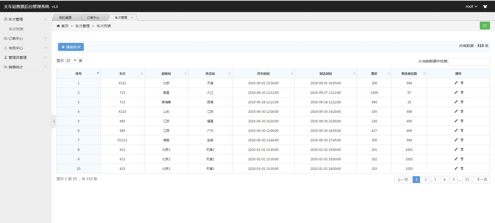
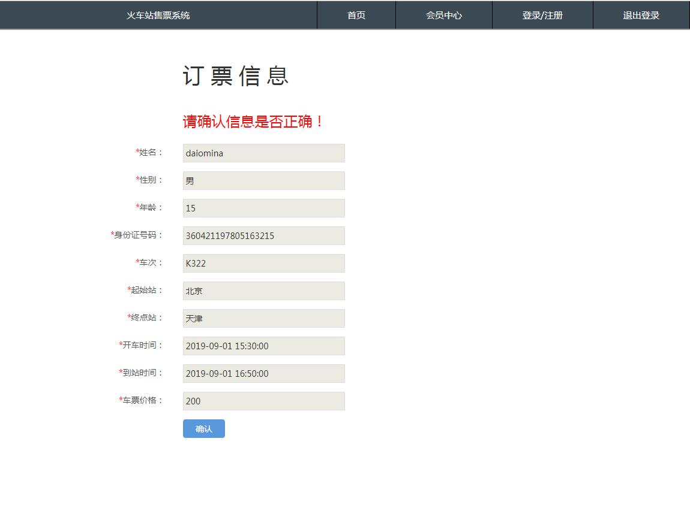
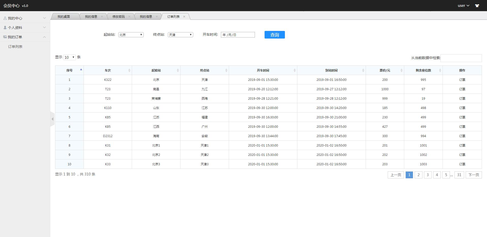
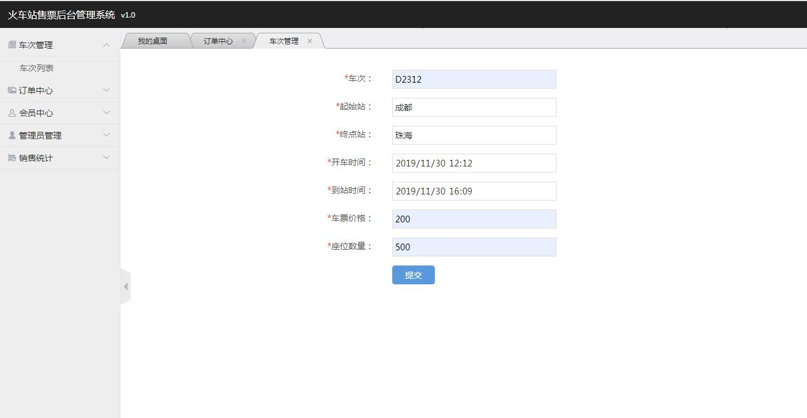
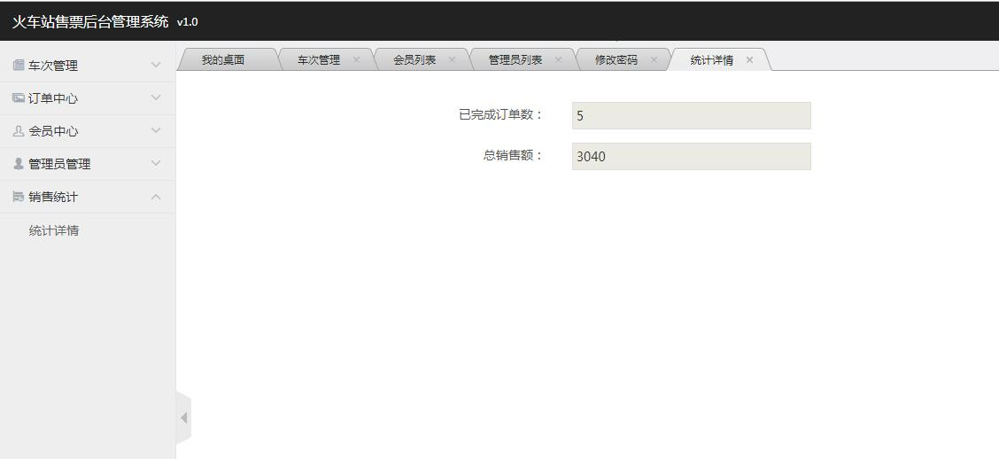

<h1 align="center">基于JSP+Servlet实现的火车站售票系统</h1>

<h4> 完整代码获取地址：从戎源码网（https://armycodes.com/） </h4>
<h4> 作者微信：19941326836 QQ：605739993 QQ群：655392706 </h4>
<h4> 承接计算机毕设、Java毕业设计、Python毕业设计、深度学习、机器学习 </h4>
<h4> 选题+开题报告+任务书+程序定制+安装调试+论文+答辩ppt 一条龙服务 </h4>
<h4> 毕业设计所有选题地址：(https://github.com/Descartes007/allProject) </h4>

## 一、项目介绍

基于JSP+Servlet实现的火车站售票系统：前端 JSP、BootStrap、JQuery、Ajax，后端 Servlet，系统角色分为：会员和管理员。主要功能如下：

### 1、管理员：

1、管理员首页
2、我的信息
3、修改密码
4、添加管理
5、添加会员
6、会员中心
7、添加车次
8、车次管理
9、订单中心
10、导出Excel
11、销售统计

### 2、会员：

1、首页
2、注册
3、登录
4、我的信息
5、个人信息
6、修改密码
7、我的订单
8、订票信息确认
9、付款
10、改签
11、退票

## 二、环境

- <b>IntelliJ IDEA 2020.3</b>

- <b>Mysql 5.7.26</b>

- <b>Tomcat 7.0.108</b>

- <b>JDK 1.8</b>

## 三、运行截图

